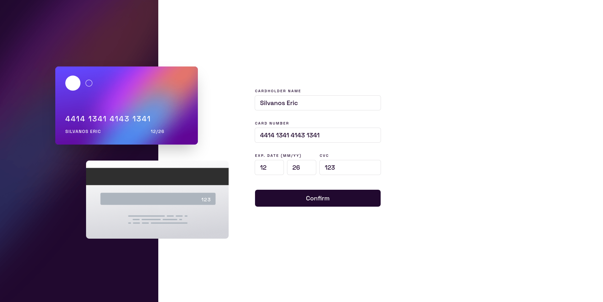

# Frontend Mentor - Interactive card details form solution

This is a solution to the [Interactive card details form challenge on Frontend Mentor](https://www.frontendmentor.io/challenges/interactive-card-details-form-XpS8cKZDWw). Frontend Mentor challenges help you improve your coding skills by building realistic projects.

## Table of contents

- [Overview](#overview)
  - [The challenge](#the-challenge)
  - [Screenshot](#screenshot)
  - [Links](#links)
- [My process](#my-process)
  - [Built with](#built-with)
  - [What I learned](#what-i-learned)
  - [Continued development](#continued-development)
  - [Useful resources](#useful-resources)
- [Author](#author)

**Note: Delete this note and update the table of contents based on what sections you keep.**

## Overview

### The challenge

Users should be able to:

- Fill in the form and see the card details update in real-time
- Receive error messages when the form is submitted if:
  - Any input field is empty
  - The card number, expiry date, or CVC fields are in the wrong format
- View the optimal layout depending on their device's screen size
- See hover, active, and focus states for interactive elements on the page

### Screenshot



### Links

- Solution URL: [source code](https://github.com/codexshell/interactive-card-details-form)
- Live Site URL: [website](https://interactive-card-details-form-rho.vercel.app/)

## My process

### Built with

- Semantic HTML5 markup
- CSS custom properties
- Flexbox
- CSS Grid
- Mobile-first workflow
- [SvelteKit](https://kit.svelte.dev/) - JS library
- [CUBE](https://nextjs.org/) - CSS Methodology
- [tailwindcss](https://styled-components.com/) - CSS Framework
- [cleavejs](https://nosir.github.io/cleave.js/) - JS library

### What I learned

- To disable browser automatic form validation, use the `novalidate` form attribute.

```html
<form novalidate>...</form>
```

- How to create an object with dynamic keys in JavaScript
- This is made possible by enclosing the expression inside square brackets.

```js
const key = 'title';
const value = 'JavaScript';

const course = {
	[key]: value,
	price: '$99'
};
```

- In the above code [key] will evaluate the expression to `title`

- The attribute is a boolean attribute it presence turns off automatic form validation. In it's absence the browser will continue with automatic form validation

### Continued development

- Client-side form validation using only JavaScript - [MDN](https://developer.mozilla.org/en-US/docs/Learn/Forms/Form_validation)

- [Conventional Commits](https://www.conventionalcommits.org/en/v1.0.0/)

### Useful resources

- [Setting linear gradient on border](https://css-tricks.com/gradient-borders-in-css/) - This helped me to set up a linear-gradient on a border.

- [Client-side form validation](https://developer.mozilla.org/en-US/docs/Learn/Forms/Form_validation) - This is an amazing article which helped understand the different types of client-side form validation. I'd recommend it to anyone still learning this concept.

- [How to create an object with dynamic keys in JavaScript](https://attacomsian.com/blog/javascript-create-object-with-dynamic-keys) - This allows one to have expressions as the keys of JavaScript object

## Author

- Website - [Silvanos Eric](https://codexshell.github.io/)
- Frontend Mentor - [@codexshell](https://www.frontendmentor.io/profile/codexshell)
